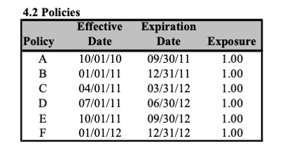
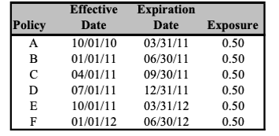

-   Annual policies

-   6 months policies

-   Blocks of exposures

------------------------------------------------------------------------

------------------------------------------------------------------------

1.  Represent as a figure

2.  Represent CY

3.  Represent PY

4.  Distribution of WE for each CY

5.  Redo if policy D cancels on March 31 2012

6.  WE PY

7.  redo like 5.

8.  CY EE as of YE 2012

9.  PY EE as of YE 2012

10. Graphically represent in-force expo as of 6/15/2011

11. Calculate in-force expo as of 1/1/11 6/15/11 and 1/1/12

------------------------------------------------------------------------

------------------------------------------------------------------------

1.  Represent graphically

2.  Calculate CY WE expo as of 12/31/12

3.  Calculate CY EE as of 12/31/2012

4.  Calculate PY WE as of 12/31/2012

5.  Calculate PY EE as of 12/31/2012

6.  Calculate in force expo by Date for: 1/1/11, 6/15/11, 1/1/12

------------------------------------------------------------------------

Assume a company begins writing in 2010 and writes 240 annual policies a month for 12 months,

------------------------------------------------------------------------

1.  calculate the inforce expo a/o 7/1/10, 1/1/11 and 7/1/11

2.  Calculate the CY EE 2010, 2011 as of YE 2011
